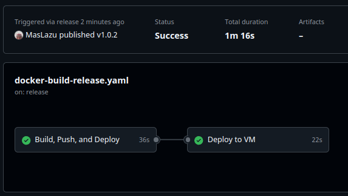
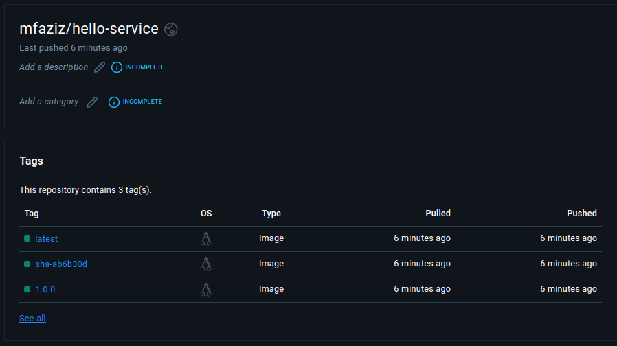

# Hello World REST API

A simple REST API project to explore GitHub Actions CI/CD capabilities. This project demonstrates how to set up automated Docker builds and releases using GitHub Actions.

## 🎯 Key Features

- Simple REST API endpoint using Go standard library
- GitHub Actions workflow for:
  - Automated Docker builds
  - Multi-platform image builds
  - Automated releases
  - Docker Hub integration
- Docker multi-stage builds
- Environment-based configuration

## 🚀 GitHub Actions Workflows

### Docker Build and Push (`docker-build-release.yaml`)

This workflow automatically:
1. Builds Docker images on:
   - Every push to main branch
   - New release publication
2. Tags images based on:
   - Branch name (e.g., `hello-service:main`)
   - Semantic version from release (e.g., `hello-service:1.0.0`)
   - Git SHA (e.g., `hello-service:sha-a1b2c3d`)
3. Pushes images to Docker Hub

## 🛠️ Local Development

### Prerequisites
- Go 1.22+
- Docker

## Project Structure

```
hello-api-example/
├── .github/
│ └── workflows/
│    └── docker-build-release.yaml
├── .gitignore
├── Dockerfile
├── README.md
├── RELEASE.md
├── go.mods
└── main.go
```

## Documentation




